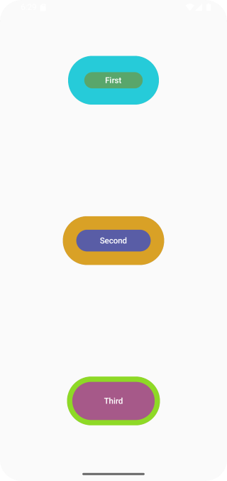
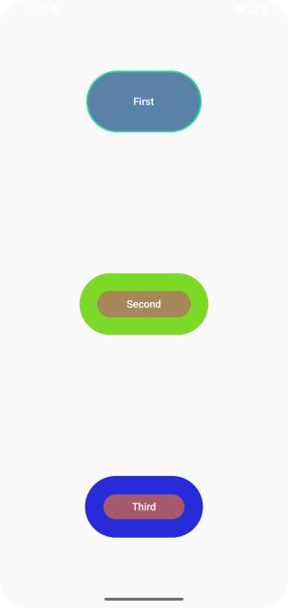
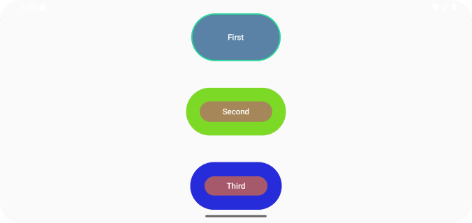
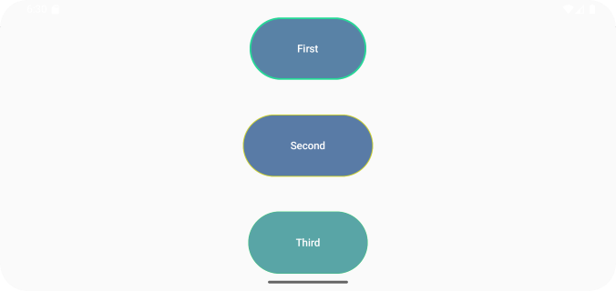
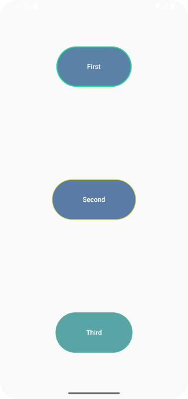

# Домашнее задание по теме "Button"

## Игра «Случайные кнопки»

На основе пройденного материала необходимо написать приложение-игру «Случайные кнопки».

Суть игры заключается в том, что у нас есть три кликабельных `Button`. При нажатии на одну из них, рандомно меняются параметры остальных двух. Меняться должны следующие параметры: цвет контейнера кнопки (параметр `colors`), толщина границы кнопки (параметр `border`), цвет границы кнопки (параметр `border`). Победной ситуация считается в том случае, если у всех трех кнопок установились одинаковые параметры. Эта игра не является головоломкой или игрой на логику: здесь либо повезет, либо не повезет. Рекомпозиция элементов должна происходить моментально.

При изменении ориентации экрана, состояние компонентов должно сохраняться.

Приложение необходимо сохранить проектом в удаленном репозитории, для проверки качества предоставить ссылку преподавателю, либо сделать скрины эмулятора при каждом шаге работы приложения или снять видео экрана при работе приложения.

## Скриншоты

Скриншоты здесь

